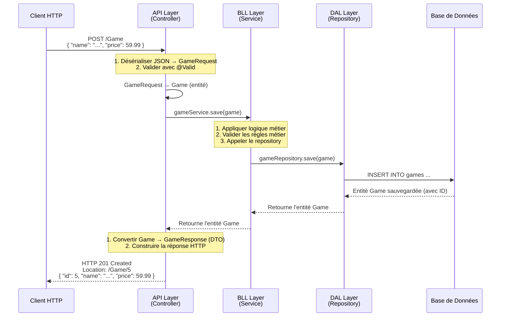
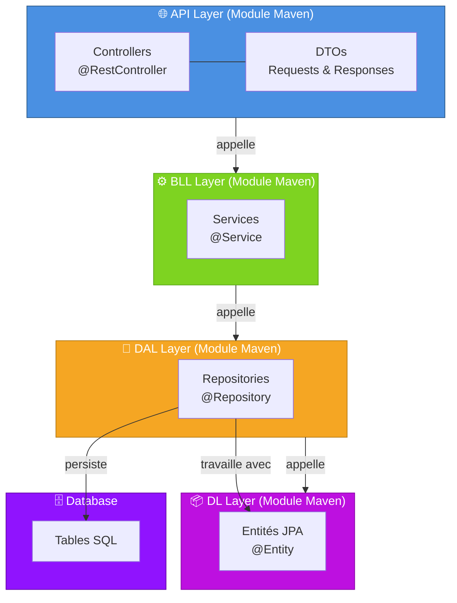
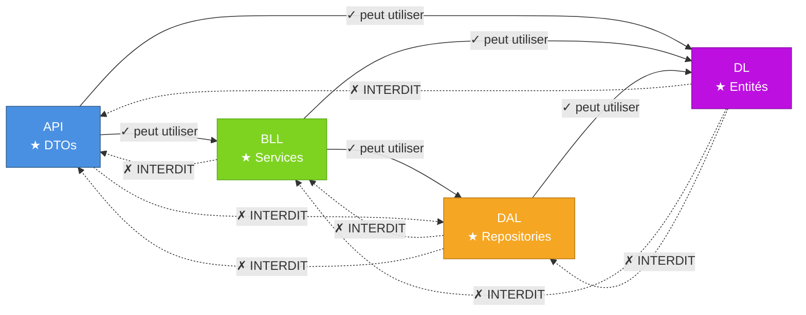

# Architecture en Couches : API, BLL, DAL, DL

## Introduction

Une application bien architecturée sépare les responsabilités en **couches distinctes**. Chaque couche a un rôle spécifique et communique avec les autres selon des règles bien définies.

Dans ce projet, nous utilisons une architecture à **4 couches** :
- **API** (Application Programming Interface)
- **BLL** (Business Logic Layer)
- **DAL** (Data Access Layer)
- **DL** (Domain Layer)

Chaque couche sera un **module Maven indépendant**, ce qui impose des règles strictes pour éviter les dépendances circulaires.

---

## Les 4 Couches

### 1. DL - Domain Layer (Domaine métier)

**Rôle** : Contient les **entités métier** et les règles métier fondamentales.

**Responsabilités** :
- Définir les entités JPA (`@Entity`)
- Contenir les données brutes du domaine
- Valider les règles métier fondamentales

**Exemple** :
```java
@Entity
@Table(name = "games")
public class Game {
    
    @Id
    @GeneratedValue(strategy = GenerationType.IDENTITY)
    private Integer id;
    
    @NotBlank
    private String name;
    
    @NotNull
    @Positive
    private BigDecimal price;
    
    // getters, setters
}
```

**Point important** : La couche DL ne connaît rien des autres couches. Elle est complètement indépendante.

---

### 2. DAL - Data Access Layer

**Rôle** : Gère l'**accès aux données** (base de données, fichiers, APIs externes, etc.).

**Responsabilités** :
- Les repositories JPA (`@Repository`)
- Les requêtes à la base de données
- La persistance des données
- Convertir les données brutes en entités métier

**Exemple** :
```java
@Repository
public interface GameRepository extends JpaRepository<Game, Integer> {
    
    List<Game> findByPriceGreaterThan(BigDecimal price);
    
    Page<Game> findAll(Pageable pageable);
}
```

**Dépendances** :
- DAL dépend de **DL** (pour les entités)
- DAL ne dépend de rien d'autre

**Point important** : La DAL ne connaît pas BLL ni API. Elle ne fait que persister et récupérer des données.

---

### 3. BLL - Business Logic Layer

**Rôle** : Contient la **logique métier** de l'application.

**Responsabilités** :
- Les services (`@Service`)
- Appliquer les règles métier complexes
- Orchestrer les opérations
- Valider les données métier
- Appeler le DAL pour persister

**Exemple** :
```java
@Service
@RequiredArgsConstructor
public class GameService {
    
    private final GameRepository gameRepository;
    
    public Page<Game> find(Pageable pageable) {
        return gameRepository.findAll(pageable);
    }
    
    public Game findById(Integer id) {
        return gameRepository.findById(id)
            .orElseThrow(() -> new EntityNotFoundException("Jeu non trouvé"));
    }
    
    public Game save(Game game) {
        // Logique métier complexe ici
        validateGame(game);
        return gameRepository.save(game);
    }
    
    private void validateGame(Game game) {
        // Vérifications métier
    }
}
```

**Dépendances** :
- BLL dépend de **DL** (pour les entités)
- BLL dépend de **DAL** (pour les repositories)
- BLL ne dépend PAS de API

**Point important** : Les services travaillent avec les **entités du domaine**, pas avec les DTOs. Les DTOs sont une préoccupation de la couche API.

---

### 4. API - Application Programming Interface

**Rôle** : Expose l'application au monde extérieur via HTTP.

**Responsabilités** :
- Les contrôleurs (`@RestController`)
- Recevoir les requêtes HTTP
- Valider les entrées utilisateur
- Appeler les services métier
- Retourner les réponses au client
- Convertir entités ↔ DTOs

**Exemple** :
```java
@RestController
@RequiredArgsConstructor
@RequestMapping("/Game")
public class GameController {
    
    private final GameService gameService;
    
    @GetMapping
    public ResponseEntity<Page<GameResponse>> find(
        @RequestParam(name = "page", required = false, defaultValue = "0") int page,
        @RequestParam(name = "size", required = false, defaultValue = "10") int size
    ) {
        Pageable pageable = PageRequest.of(page, size, Sort.by("id").ascending());
        Page<Game> games = gameService.find(pageable);
        Page<GameResponse> responsePage = games.map(GameResponse::fromGame);
        return ResponseEntity.ok(responsePage);
    }
    
    @PostMapping
    public ResponseEntity<Void> save(@Valid @RequestBody GameRequest gameRequest) {
        Game game = gameRequest.toGame();
        Game response = gameService.save(game);
        
        URI uri = ServletUriComponentsBuilder
                .fromCurrentRequest()
                .path("/{id}")
                .buildAndExpand(response.getId())
                .toUri();
        
        return ResponseEntity.created(uri).build();
    }
}
```

**Dépendances** :
- API dépend de **BLL** (pour appeler les services)
- API dépend de **DL** (pour les entités)
- API NE dépend de rien d'autre
- Les DTOs sont définis DANS cette couche

**Point important** : API est la seule couche qui connaît les DTOs. Les autres couches n'en parlent jamais.

---

## Structure des DTOs

Les DTOs (Data Transfer Objects) doivent être définis **dans la couche API**, dans des packages séparés par domaine.

**Structure suggérée** :
```
src/main/java/be/bstorm/tf_java_2026_introspringapi/
├── api/
│   ├── controllers/
│   │   ├── GameController.java
│   │   └── AuthController.java
│   └── model/
│       ├── game/
│       │   ├── requests/
│       │   │   └── GameRequest.java
│       │   └── responses/
│       │       └── GameResponse.java
│       └── user/
│           ├── requests/
│           │   ├── LoginRequest.java
│           │   └── RegisterRequest.java
│           └── responses/
│               ├── UserResponse.java
│               └── UserTokenResponse.java
├── bll/
│   └── services/
│       ├── GameService.java
│       └── AuthService.java
├── dal/
│   └── repositories/
│       ├── GameRepository.java
│       └── UserRepository.java
└── dl/
    └── entities/
        ├── Game.java
        └── User.java
```

---

## Flux de Données : Une Requête HTTP Complète

Visualisons comment une requête POST pour créer un jeu traverse toutes les couches :



---

## Diagramme d'Architecture Générale



---

## Dépendances Autorisées

Voici le graphique des dépendances permises :



---

## ⚠️ Le Piège des Dépendances Circulaires

### Le Problème

Imaginez que vous déclariez les DTOs dans **BLL** (au lieu de API) :

```
❌ MAUVAIS DESIGN

API → BLL (DTOs y sont définis)
BLL → API (services utilisés par contrôleurs)
      ↑___________________|
```

**Résultat** : Une **dépendance circulaire** !
- API a besoin de BLL (pour les services)
- BLL a besoin d'API (pour les DTOs)

Cela crée un chaos de dépendances que Maven/Gradle ne peut pas résoudre.

### La Solution : DTOs dans API

```
✓ BON DESIGN

API (DTOs + Contrôleurs) → BLL (Services) → DAL (Repositories) → DL (Entités)
        |_______________________________↑__________________|
        Flux à sens unique = pas de cycle !
```

**Règle d'or** : Les dépendances doivent TOUJOURS aller dans une seule direction. Jamais de retour en arrière.

---

## Exemple Concret : Une Opération Complète

### Scénario : Créer un nouveau jeu

#### 1. La Requête Arrive à l'API
```java
// GameController.java (API Layer)
@PostMapping
public ResponseEntity<Void> save(@Valid @RequestBody GameRequest gameRequest) {
    // gameRequest est un DTO défini dans la couche API
    // Il contient les données du formulaire envoyées par le client
    
    Game game = gameRequest.toGame();  // Convertir DTO → Entité
    Game response = gameService.save(game);  // Appeler BLL
    
    // Convertir la réponse en DTO avant de retourner au client
    URI uri = ServletUriComponentsBuilder
            .fromCurrentRequest()
            .path("/{id}")
            .buildAndExpand(response.getId())
            .toUri();
    
    return ResponseEntity.created(uri).build();
}
```

**Observations** :
- ✅ Reçoit un DTO (GameRequest)
- ✅ Convertit en entité JPA (Game)
- ✅ Appelle le service de BLL
- ✅ Retourne une réponse HTTP appropriée

#### 2. La Logique Métier s'Exécute (BLL)
```java
// GameService.java (BLL Layer)
@Service
@RequiredArgsConstructor
public class GameService {
    
    private final GameRepository gameRepository;
    
    public Game save(Game game) {
        // Ici JAMAIS de DTO !
        // Uniquement des entités du domaine
        
        validateGame(game);  // Logique métier
        return gameRepository.save(game);  // Persister
    }
    
    private void validateGame(Game game) {
        // Vérifier que le jeu est valide selon les règles métier
        if (game.getPrice().compareTo(BigDecimal.ZERO) <= 0) {
            throw new BusinessException("Le prix doit être positif");
        }
    }
}
```

**Observations** :
- ✅ Ne connaît rien des DTOs
- ✅ Travaille uniquement avec des entités JPA
- ✅ Appelle le repository pour persister
- ✅ Aucune dépendance vers API

#### 3. Les Données sont Persistées (DAL)
```java
// GameRepository.java (DAL Layer)
@Repository
public interface GameRepository extends JpaRepository<Game, Integer> {
    
    Page<Game> findAll(Pageable pageable);
    
    // Ici JAMAIS de DTO, JAMAIS de logique métier complexe
    // Juste des requêtes à la base de données
}
```

**Observations** :
- ✅ Utilise uniquement les entités du domaine
- ✅ Persiste en base de données
- ✅ Aucune connaissance de BLL ou API

#### 4. Les Entités Définissent le Domaine (DL)
```java
// Game.java (DL Layer)
@Entity
@Table(name = "games")
public class Game {
    
    @Id
    @GeneratedValue(strategy = GenerationType.IDENTITY)
    private Integer id;
    
    @NotBlank
    private String name;
    
    @NotNull
    @Positive
    private BigDecimal price;
    
    // Getters et setters
}
```

**Observations** :
- ✅ Définit les données du domaine
- ✅ Complètement indépendante
- ✅ Ne connaît rien des autres couches

---

## Structure des Modules Maven

Quand ce projet évoluera vers des modules Maven, voici la structure :

```
tf_java_2026_introspringapi/
├── pom.xml (parent)
├── tf_java_2026_introspringapi_dl/
│   ├── pom.xml
│   └── src/main/java/
│       └── be/bstorm/tf_java_2026_introspringapi/dl/entities/
├── tf_java_2026_introspringapi_dal/
│   ├── pom.xml (dépend de DL)
│   └── src/main/java/
│       └── be/bstorm/tf_java_2026_introspringapi/dal/repositories/
├── tf_java_2026_introspringapi_bll/
│   ├── pom.xml (dépend de DL et DAL)
│   └── src/main/java/
│       └── be/bstorm/tf_java_2026_introspringapi/bll/services/
└── tf_java_2026_introspringapi_api/
    ├── pom.xml (dépend de BLL et DL)
    └── src/main/java/
        └── be/bstorm/tf_java_2026_introspringapi/api/
            ├── controllers/
            └── model/ (DTOs)
```

**pom.xml de chaque module** :

```xml
<!-- tf_java_2026_introspringapi_dal/pom.xml -->
<parent>
    <groupId>be.bstorm</groupId>
    <artifactId>tf_java_2026_introspringapi</artifactId>
    <version>1.0</version>
</parent>

<dependencies>
    <!-- DAL dépend de DL -->
    <dependency>
        <groupId>be.bstorm</groupId>
        <artifactId>tf_java_2026_introspringapi_dl</artifactId>
        <version>1.0</version>
    </dependency>
</dependencies>
```

```xml
<!-- tf_java_2026_introspringapi_bll/pom.xml -->
<dependencies>
    <!-- BLL dépend de DL et DAL -->
    <dependency>
        <groupId>be.bstorm</groupId>
        <artifactId>tf_java_2026_introspringapi_dl</artifactId>
        <version>1.0</version>
    </dependency>
    <dependency>
        <groupId>be.bstorm</groupId>
        <artifactId>tf_java_2026_introspringapi_dal</artifactId>
        <version>1.0</version>
    </dependency>
</dependencies>
```

```xml
<!-- tf_java_2026_introspringapi_api/pom.xml -->
<dependencies>
    <!-- API dépend de BLL et DL -->
    <dependency>
        <groupId>be.bstorm</groupId>
        <artifactId>tf_java_2026_introspringapi_bll</artifactId>
        <version>1.0</version>
    </dependency>
    <dependency>
        <groupId>be.bstorm</groupId>
        <artifactId>tf_java_2026_introspringapi_dl</artifactId>
        <version>1.0</version>
    </dependency>
</dependencies>
```

---

## Résumé par Couche

| Couche | Rôle | Contient | Dépend de | Aucune dépendance vers |
|--------|------|----------|-----------|------------------------|
| **API** | Exposition HTTP | Controllers, DTOs, Conversions | BLL, DL | DAL, rien d'autre |
| **BLL** | Logique métier | Services, Validations, Orchestration | DL, DAL | API |
| **DAL** | Accès aux données | Repositories, Requêtes SQL | DL | API, BLL |
| **DL** | Domaine métier | Entités JPA, Règles fondamentales | Rien | Aucune autre couche |

---

## Points Clés à Retenir

✅ **Séparation des responsabilités** :
- Chaque couche a UN rôle bien défini
- Les couches sont découplées autant que possible

✅ **Flux unidirectionnel** :
- API → BLL → DAL → DL
- Jamais de dépendance inverse

✅ **DTOs = Couche API** :
- Les DTOs sont UNIQUEMENT dans l'API
- Les services ne connaissent pas les DTOs
- La conversion DTO ↔ Entité se fait dans les contrôleurs

✅ **Prévention des cycles de dépendances** :
- Pas de dépendance bidirectionnelle
- Les modules Maven enforceront cette règle

✅ **Testabilité** :
- Chaque couche peut être testée indépendamment
- Les dépendances claires permettent les mocks faciles

✅ **Maintenabilité** :
- Si un changement est nécessaire en DAL, seuls les modules qui en dépendent sont affectés
- Avec des modules Maven distincts, c'est très clair qui dépend de qui
