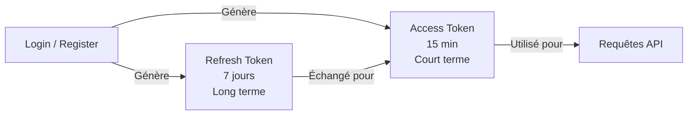
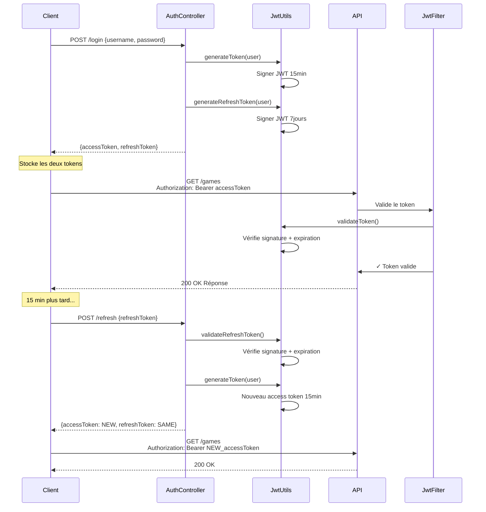
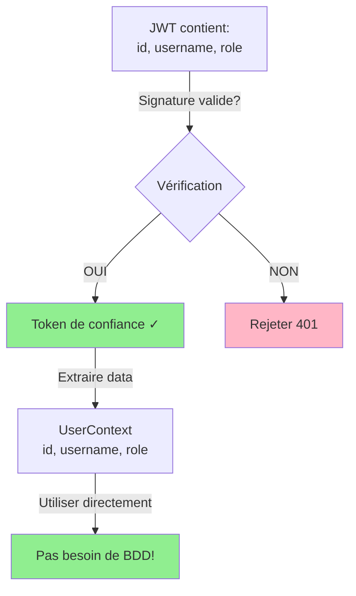
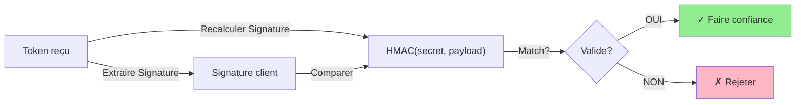
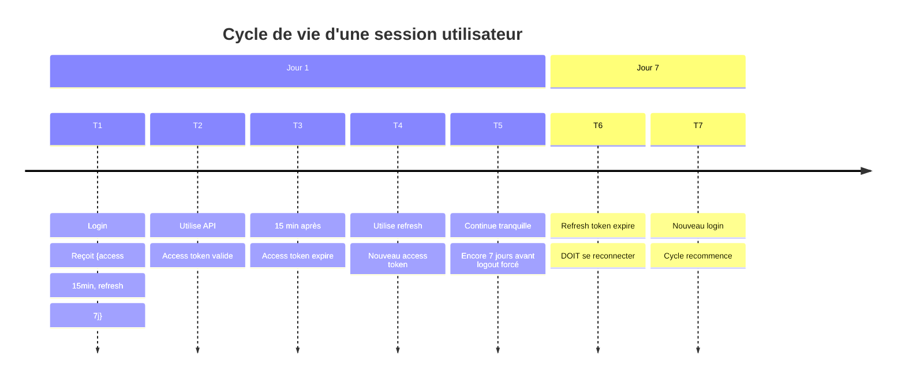

# 07 - Refresh Token : Architecture et Implémentation

## Contexte : Pourquoi les Refresh Tokens ?

Imaginez un scénario classique sans refresh tokens :

```
User login
   ↓
Access token (15 min)
   ↓
Utilise l'API pendant 10 min
   ↓
Reste 5 min avant expiration
   ↓
5 min plus tard : Token expiré → Doit se reconnecter
   ↓
Expérience utilisateur catastrophique ! 😱
```

**Les problèmes sans refresh tokens :**
- ❌ Access tokens trop courts : oblige à se reconnecter souvent
- ❌ Access tokens trop longs : risque de sécurité augmente
- ❌ Pas de solution intermédiaire

## Solution : Refresh Token Pattern

```
Login
   ↓
Reçoit : {accessToken: "15min", refreshToken: "7jours"}
   ↓
Utilise API avec accessToken
   ↓
AccessToken expire (15 min)
   ↓
Client utilise refreshToken → Obtient nouveau accessToken
   ↓
Continue sans se reconnecter !
   ↓
Après 7 jours : refreshToken expire → Doit se reconnecter
```

## Architecture Implémentée

### Tokens : Two-Tier Model



### Types de Tokens

| Aspect | Access Token | Refresh Token |
|--------|-------------|---|
| **Durée** | 15 minutes | 7 jours |
| **Utilisation** | Valider chaque requête API | Obtenir nouvel access token |
| **Stockage** | Mémoire client | Mémoire client |
| **Révocation** | Auto via expiration | Auto via expiration (pas de BDD) |
| **Claims** | id, username, role | id, username, role |

## Flux d'Authentification Complet



## Modifications : Du JWT Filter au Trust Model

### ❌ Avant : Load User from Database

```java
// Ancien pattern
String token = extractToken(request);
String username = jwtUtils.getUsername(token);
User user = userRepository.findByUsername(username); // 🔴 BDD call!
// Problèmes:
// - Requête BDD à chaque fois
// - Lent et non-scalable
// - Dépendance BDD obligatoire
```

### ✅ Après : Trust the Token (JWT as Source of Truth)

```java
// Nouveau pattern
String token = extractToken(request);
UserContext userContext = jwtUtils.getUser(token); // 🟢 Extrait du JWT !
// Avantages:
// - Pas de requête BDD
// - Ultra rapide (parsing JSON)
// - Stateless et scalable
// - JWT = source de vérité
```

### Diagramme Conceptuel



## Pourquoi Faire Confiance au Token ?

### Principe Fondamental du JWT

```
JWT = Header.Payload.Signature

- Header: Algo (HS256)
- Payload: {id, username, role, exp}
- Signature: HMAC(secret, Header.Payload)
```

**Si la signature est valide :** Le payload n'a pas été modifié. C'est impossible de changer `id: 5` en `id: 1` sans casser la signature.

### Processus de Validation



## Implémentation Détaillée

### 1. Génération des Tokens

```java
// Access Token : 15 minutes
public String generateToken(User user) {
    return jwtBuilder
            .subject(user.getUsername())
            .claim("id", user.getId())
            .claim("role", user.getRole().getName())
            .issuedAt(new Date())
            .expiration(new Date(System.currentTimeMillis() + 900 * 1000)) // 15 min
            .compact();
}

// Refresh Token : 7 jours
public String generateRefreshToken(User user) {
    return jwtBuilder
            .subject(user.getUsername())
            .claim("id", user.getId())
            .claim("role", user.getRole().getName())
            .issuedAt(new Date())
            .expiration(new Date(System.currentTimeMillis() + 604800 * 1000)) // 7 jours
            .compact();
}
```

### 2. Validation et Extraction

```java
// Validation unique
public boolean validateToken(String token) {
    Claims claims = parseToken(token);
    Date now = new Date();
    return now.after(claims.getIssuedAt()) && now.before(claims.getExpiration());
}

// Extraction des données (Trust the Token!)
public UserContext getUser(String token) {
    return new UserContext(
            getId(token),
            getUsername(token),
            getRole(token)
    );
}
```

### 3. Utilisation dans le Filter

```java
@Override
protected void doFilterInternal(HttpServletRequest request, ...) {
    String authorizationHeader = request.getHeader("Authorization");
    
    if(authorizationHeader != null && authorizationHeader.startsWith("Bearer ")) {
        String token = authorizationHeader.substring(7);
        
        // 🟢 Extrait directement du token, pas de BDD!
        UserContext user = jwtUtils.getUser(token);
        
        UsernamePasswordAuthenticationToken upt = new UsernamePasswordAuthenticationToken(
                user,
                token,
                user.getAuthorities()
        );
        
        SecurityContextHolder.getContext().setAuthentication(upt);
    }
    
    filterChain.doFilter(request, response);
}
```

## Endpoint Refresh Token

### POST /refresh

```
Request:
{
  "refreshToken": "eyJhbGc..."
}

Response (200 OK):
{
  "user": { id, username, role },
  "accessToken": "eyJhbGc...",  // NOUVEAU 15min
  "refreshToken": "eyJhbGc..."  // MÊME (7 jours restants)
}

Error (401):
{
  "error": "Invalid or expired refresh token"
}
```

## Avantages de Cette Approche

| Aspect | Avantage |
|--------|----------|
| **Performance** | Pas de requête BDD → Ultra rapide |
| **Scalabilité** | Stateless → Peut scaler horizontalement |
| **Sécurité** | JWT signé → Impossible de tricher |
| **UX** | Refresh token 7j → Pas de reconnexion fréquente |
| **Simplicité** | Pas de table de revocation → Moins de complexité |

## Timeline de Vie d'une Session



## Points Clés à Retenir

1. **Two-Tier Model** : Balancer court terme (access) vs long terme (refresh)
2. **Trust the Token** : JWT signé = source de vérité, pas besoin de BDD
3. **Stateless** : Chaque serveur peut valider le token indépendamment
4. **Sécurité** : Access token court limite l'impact d'une fuite
5. **UX** : Refresh token long permet une bonne expérience utilisateur

---

**Voir aussi :** `09_RateLimit.md`
