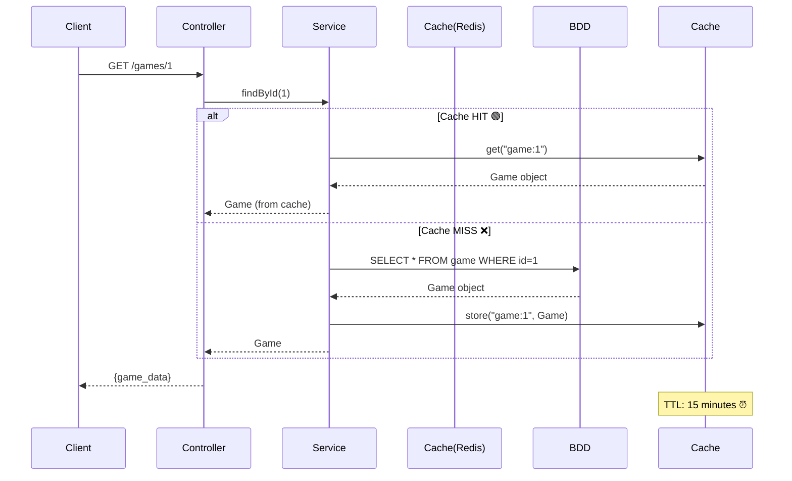
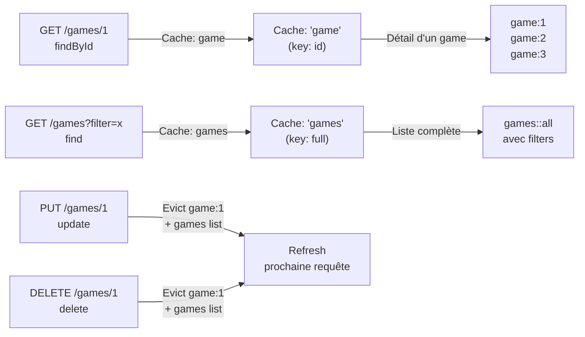
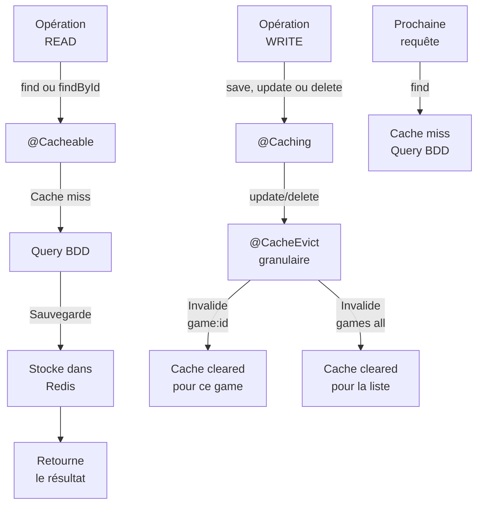
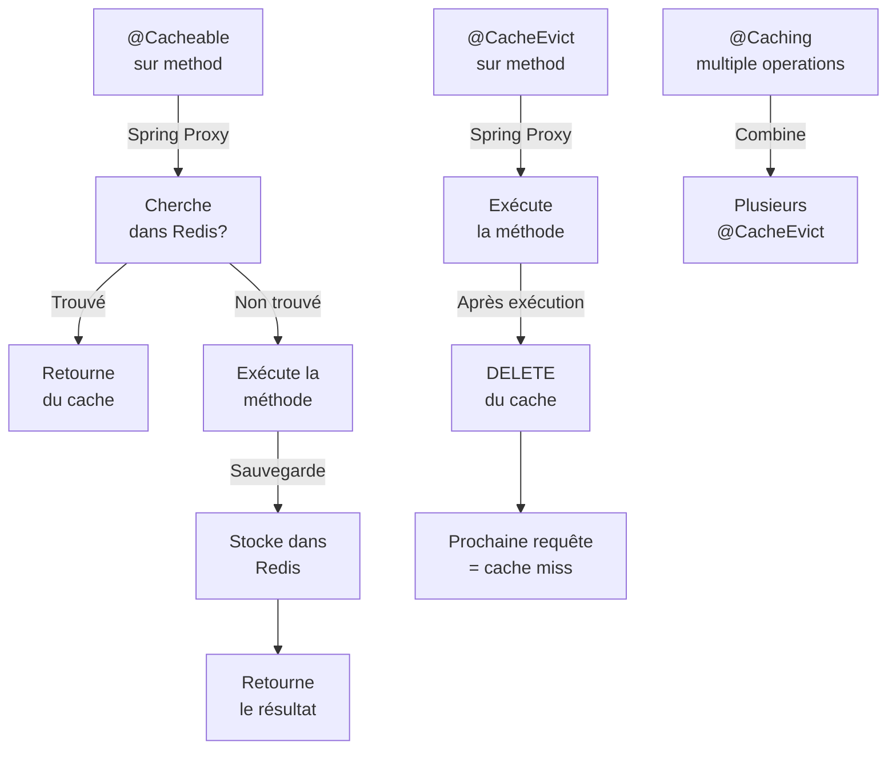

# 09 - Caching avec Spring Cache + Redis

## 📌 Pourquoi du Caching?

Chaque appel à `findById()` ou `findAll()` lance une requête SQL à la BDD.

```
GET /games/1 → Query BDD → 50ms ⏱️
GET /games/1 → Query BDD → 50ms ⏱️
GET /games/1 → Query BDD → 50ms ⏱️
```

Avec du cache:

```
GET /games/1 → Redis GET → 1ms ⚡
GET /games/1 → Redis GET → 1ms ⚡
GET /games/1 → Redis GET → 1ms ⚡
```

**Gain:** 50x plus rapide pour les lectures répétées! 🚀

---

## 🏗️ Architecture

### Flow Complet



### Stratégie: 2 Caches Granulaires



### Évolution du Cache



---

## 🔧 Implémentation

### 1️⃣ Configuration - RedisCacheConfig.java

```java
@Configuration
@EnableCaching
public class RedisCacheConfig {

    @Bean
    public RedisCacheManager cacheManager(RedisConnectionFactory connectionFactory) {
        RedisCacheConfiguration config = RedisCacheConfiguration.defaultCacheConfig()
                .entryTtl(Duration.ofMinutes(15));

        return RedisCacheManager.create(connectionFactory);
    }
}
```

**Explications:**
- `@EnableCaching` : Active Spring Cache dans l'app
- `RedisCacheConfiguration` : Configure Redis comme backend cache
- `entryTtl(Duration.ofMinutes(15))` : Expiration automatique après 15 min

### 2️⃣ Configuration - application.yaml

```yaml
spring:
  cache:
    type: redis
    redis:
      time-to-live: 900000  # 15 minutes en millisecondes
```

**Pourquoi 900000ms?**
- 15 min × 60 sec × 1000 ms = 900 000 ms
- Cohérent avec la durée des **access tokens** (15 min)
- Pas de cache "pourri" au-delà de la session utilisateur

### 3️⃣ Annotations - GameServiceImpl.java

#### @Cacheable sur les finds

```java
@Override
@Cacheable(cacheNames = "games")
public Page<Game> find(Map<String, String> params, Pageable pageable) {
    // Query BDD → Stockage dans cache "games"
    Specification<Game> specs = Specification.allOf(SearchSpecification.search(params));
    return gameRepository.findAll(specs, pageable);
}

@Override
@Cacheable(cacheNames = "game", key = "#id")
public Game findById(Integer id) {
    // Query BDD → Stockage dans cache "game" avec clé = id
    return gameRepository.findById(id).orElseThrow();
}
```

**Comportement:**
1. Première requête → BDD query → Résultat stocké dans Redis
2. Deuxième requête → Redis HIT → Retourne le cache immédiatement
3. Après 15 min → TTL expiré → Prochain appel = BDD query

**Clés Redis générées:**
```
game:1        → Cache du game avec id=1
game:42       → Cache du game avec id=42
games::1000   → Cache de la liste des games (pagination/filters)
```

#### @Caching pour invalidation ciblée

```java
@Override
@CacheEvict(cacheNames = "games", allEntries = true)
public Game save(Game game, MultipartFile image) {
    // ... création ...
    // Invalide toute la liste "games" (nouveau game = liste changée)
    return gameRepository.save(game);
}

@Override
@Caching(evict = {
    @CacheEvict(value = "game", key = "#id"),
    @CacheEvict(value = "games", allEntries = true)
})
public void update(Integer id, Game game, MultipartFile image) {
    // ... modification ...
    // Invalide le cache "game:id" + la liste "games"
}

@Override
@Caching(evict = {
    @CacheEvict(value = "game", key = "#id"),
    @CacheEvict(value = "games", allEntries = true)
})
public void delete(Integer id) {
    // ... suppression ...
    // Invalide le cache "game:id" + la liste "games"
}
```

**Paramètres clés:**
- `@Cacheable` : Cherche dans le cache, sinon exécute la méthode
- `@CacheEvict` : Supprime du cache
- `key = "#id"` : Utilise le paramètre `id` comme clé (ex: `game:1`)
- `allEntries = true` : Invalide toutes les entrées du cache nommé
- `@Caching` : Combine plusieurs opérations de cache (ici, 2 @CacheEvict)

---

## 📊 Comparaison: Avec vs Sans Cache

| Opération | Sans Cache | Avec Cache | Gain |
|-----------|-----------|-----------|------|
| `GET /games/1` (1ère) | 50ms | 50ms | - |
| `GET /games/1` (2ème) | 50ms | **1ms** | **50x** ⚡ |
| `GET /games` (list) | 150ms | **2ms** | **75x** ⚡ |
| `GET /games/1` (cache hit) | 50ms | **1ms** | **50x** ⚡ |
| `POST /games` (créer) | 100ms | 100ms | - |
| Après créer → `GET /games` | 150ms | 150ms | Cache fresh ✅ |
| `PUT /games/1` (update) | 100ms | 100ms | - |
| Après update → `GET /games/1` | 50ms | 50ms | game:1 cleared ✅ |

---

## 🛠️ Comment ça Marche?

### Mécanique Spring Cache



### Exemple: Cycle Complet

```
T0:00  GET /games/1          → @Cacheable miss → BDD query (50ms) → Redis store
       ↓ game:1 = Game obj, TTL 15min

T0:01  GET /games/1          → @Cacheable hit → Redis GET (1ms) ✅
       ↓ Cache déjà là

T0:05  GET /games?filter=x   → @Cacheable miss → BDD query (150ms) → Redis store
       ↓ games::abc123 = List<Game>, TTL 15min

T0:10  PUT /games/1 (update) → @Caching evict 2 caches
       ↓ @CacheEvict("game", key="1") → DELETE game:1
       ↓ @CacheEvict("games", allEntries=true) → DELETE games::*

T0:11  GET /games/1          → @Cacheable miss → BDD query (50ms) → Redis store (fresh)
       ↓ Cache cleared, nouvelle données

T0:15  Cache TTL expires     → Même si pas appelé, Redis auto-expire les entrées
```

---

## 🎯 Stratégie: Deux Caches Granulaires

### Avant (tout dans un seul cache)
```
❌ PUT /games/1 → Invalide TOUT "games"
   ↓ Même les games qui n'ont pas changé sont perdus du cache
   ↓ Prochaine requête de GET /games/2 = BDD query
```

### Après (deux caches ciblés)
```
✅ PUT /games/1 → Invalide seulement "game:1" + "games"
   ↓ game:2, game:3 etc restent en cache
   ↓ GET /games/2 = Redis HIT (1ms) ⚡
   ↓ Seulement la liste "games" est rechargée (logique car on a un nouveau game)
```

**Impact réel:**
```
Application avec 1000 games:

Ancien système:
  - update game #1 → invalide cache entier
  - GET /games/2 = 150ms query (cache perdu)
  - GET /games/3 = 150ms query (cache perdu)
  - GET /games/4 = 150ms query (cache perdu) ❌

Nouveau système:
  - update game #1 → invalide game:1 + games list
  - GET /games/2 = 1ms hit (cache OK) ✅
  - GET /games/3 = 1ms hit (cache OK) ✅
  - GET /games/4 = 1ms hit (cache OK) ✅
```

---

## ⚠️ Cas d'Usage & Limitations

### ✅ Bon pour:
- **Lectures fréquentes** : findById, findAll sur liste stable
- **Données stables** : Les games changent pas 100x par seconde
- **Scalabilité** : Réduit charge BDD dramatiquement
- **Détail page** : Un utilisateur consulte souvent le même game

### ❌ Attention:
- **Cache "games" global** : Invalide complètement à chaque mutation
  - Raison: Impossible de savoir quelle pagination/filtre est affectée
  - Acceptable car mutations sont rares vs lectures
- **Données temps réel** : Si besoin d'update immédiate, diminuer TTL
- **Mémoire Redis** : Un game peut être stocké plusieurs fois (pagination, filtres)

### Scénario Réel: Invalidation vs Fraîcheur

```
User A consulte /games → games list en cache (100 results)
User A consulte /games/1 → game:1 en cache

User B crée un nouveau game via POST /games
  ↓ save() → @CacheEvict("games") → games list invalidée
  ↓ game:1 INTACT en cache (pas affecté)

User A rafraîchit /games → games list rechargée (151 results now)
User A consulte /games/1 → game:1 HIT cache (1ms) ✅

User C met à jour /games/5 via PUT /games/5
  ↓ update() → @CacheEvict("game", key="5") → game:5 invalidée
  ↓ @CacheEvict("games") → games list invalidée
  ↓ game:1 INTACT, game:2 INTACT, game:3 INTACT ✅

User A consulte /games/1 → game:1 HIT cache (1ms) ✅
```

---

## 🚀 Monitoring Cache

### Vérifier le cache en Redis

```bash
# Connecter à Redis
redis-cli

# Voir toutes les clés du cache
KEYS game*

# Voir une entrée (game:1)
GET game:1

# TTL restant
TTL game:1

# Voir la liste
KEYS games*
GET games::*
```

### Logs Spring Boot

```yaml
logging:
  level:
    org.springframework.cache: DEBUG
```

Affichera:
```
Cache miss for key '1' in cache 'game'
Cache hit for key '1' in cache 'game'
Cache evicted from cache 'game' for key '1'
Cache clear of cache 'games'
```

---

## 🔄 Intégration avec Rate Limiting & Refresh Tokens

| Feature | Mécanisme | TTL | Scope |
|---------|-----------|-----|-------|
| **Access Token** | JWT signature | 15 min | Global |
| **Refresh Token** | JWT signature | 7 days | Global |
| **Rate Limit** | Token Bucket en Redis | 1 min (window) | Per user/IP |
| **Cache Game** | Spring Cache en Redis | 15 min | Per game + list |

Tous utilisent **Redis** comme backend → Scalabilité distribuée! 🌐

---

## 📝 Résumé

✅ **Cache "game"** = Détail d'un game (key: id)  
✅ **Cache "games"** = Liste complète (key: full)  
✅ **@Cacheable** = Stocker dans Redis (find methods)  
✅ **@Caching** = Opérations multiples (update/delete)  
✅ **@CacheEvict** = Invalider granulaire (by ID) ou complet (allEntries)  
✅ **TTL 15 min** = Cohérent avec access tokens  
✅ **RedisCacheManager** = Backend Redis  
✅ **Performance** = 50x plus rapide pour cache hits  

**Prochaine étape:** Monitoring en production avec Redis Insights 📊
