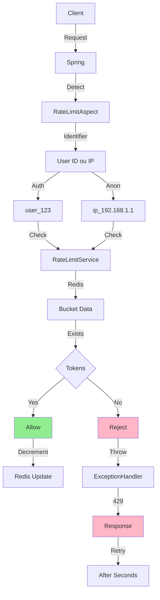
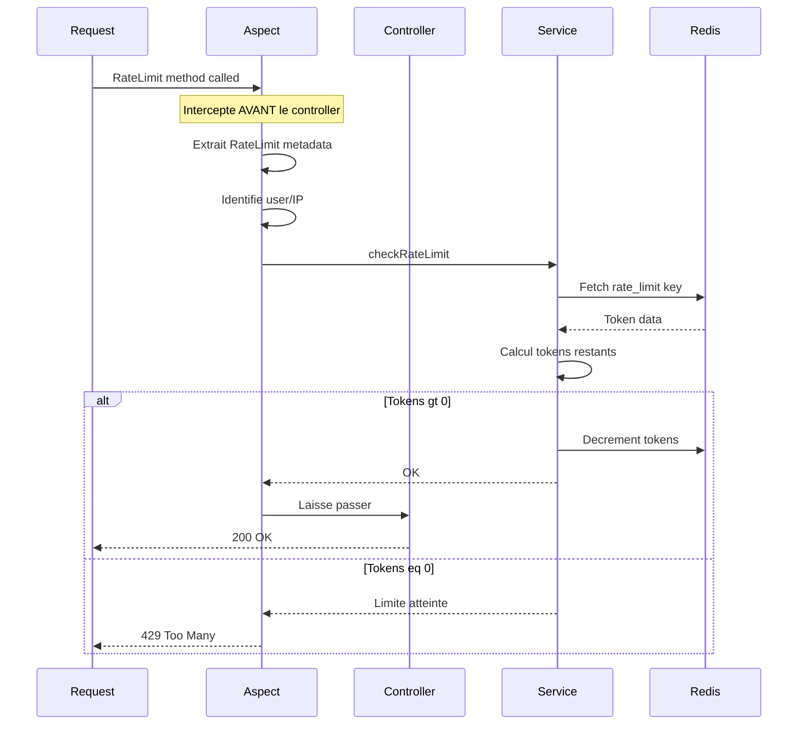
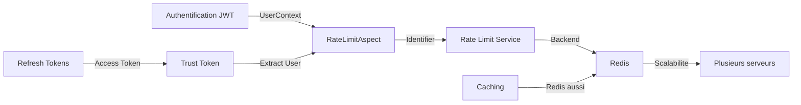

# 08 - Rate Limiting : Architecture et Implementation

## Pourquoi le Rate Limiting ?

Imaginez votre API sans protection :

```
Attaque par force brute (login):
  1000 tentatives/min
  Serveur overcharge

API compromise (scraping):
  Bot recupere tous les jeux
  BDD saturee
  
DOS (Denial of Service):
  Meme IP 10000 requetes/sec
  Serveur crash
```

**Le rate limiting = bouclier de l'API** (shield)

## Definition

**Rate Limiting** = Limiter le nombre de requetes qu'un user/IP peut faire dans une periode donnee.

```
"Max 5 login attempts par minute"
  
6eme attempt -> HTTP 429 Too Many Requests
```

## Notre Approche : Token Bucket Algorithm

### Concept Simple

Imaginez un seau avec des tokens :

```
Max tokens = 100
Refill rate = 100 tokens/min

Requete = 1 token consomme

Seau vide -> Rejeter la requete
```

### Visualisation

```
Minute 0:00
┌─────────────────────────────┐
│ Token Token Token Token      │
│ Token Token Token Token      │ = 100 tokens
│ ... (90 autres)              │
└─────────────────────────────┘

Apres 50 requetes:
┌─────────────────────────────┐
│ Token Token Token Token      │
│ EMPTY EMPTY EMPTY EMPTY (50) │ = 50 tokens restants
└─────────────────────────────┘

Minute 0:30 (refill 50%):
┌─────────────────────────────┐
│ Token Token Token Token      │
│ Token Token Token Token (25) │ = 75 tokens
│ EMPTY EMPTY EMPTY EMPTY (25) │
└─────────────────────────────┘
```

### Pourquoi Token Bucket et pas autre chose ?

| Algorithme | Avantage | Inconvenient |
|-----------|----------|-------------|
| **Fixed Window** | Simple | Pics aux limites |
| **Sliding Window** | Tres juste | Complexe en implementation |
| **Token Bucket** | Permet bursts, flexible | Legerement plus complexe |
| **Leaky Bucket** | Lisse le trafic | Rejet brutal |

**On choisit Token Bucket car :** Permet des pics controles (user peut faire 5 logins d'un coup) tout en protegeant le serveur.

## Architecture Globale



## Composants Cles

### 1 - Annotation RateLimit

```java
@Target(ElementType.METHOD)
@Retention(RetentionPolicy.RUNTIME)
public @interface RateLimit {
    int maxRequests() default 100;      // Nombre de requetes
    int windowSeconds() default 60;     // Periode de temps
}
```

**Utilisation :**
```java
@RateLimit(maxRequests = 5, windowSeconds = 60)  // 5 par minute
@PostMapping("/login")
public ResponseEntity login(...) { ... }
```

### 2 - RateLimitAspect (AOP)



### 3 - RateLimitService (Token Bucket)

**Logique du Token Bucket:**

```
checkRateLimit(userId, endpoint, maxRequests, windowSeconds):
    
    key = "rate_limit:{userId}:{endpoint}"
    current = Redis.get(key)
    
    if current == null:
        // Premiere requete
        tokens = maxRequests - 1
        Redis.set(key, tokens, TTL=windowSeconds)
        return OK
    else:
        lastRefill = current.lastRefill
        now = System.currentTime
        timeElapsed = now - lastRefill
        
        // Refill tokens proportionnellement au temps passe
        tokensToAdd = (timeElapsed / windowSeconds) * maxRequests
        tokens = min(current.tokens + tokensToAdd, maxRequests)
        
        if tokens > 0:
            tokens -= 1
            Redis.update(key, tokens)
            return OK
        else:
            throw RateLimitException
```

## Implementation Fichier par Fichier

### RateLimit.java (Annotation)

```java
@Target(ElementType.METHOD)
@Retention(RetentionPolicy.RUNTIME)
public @interface RateLimit {
    int maxRequests() default 100;
    int windowSeconds() default 60;
}
```

### RateLimitService.java (Service)

```java
@Service
@RequiredArgsConstructor
public class RateLimitService {
    
    private final StringRedisTemplate redisTemplate;
    
    public void checkRateLimit(String identifier, String endpoint, 
                              int maxRequests, int windowSeconds) {
        String key = "rate_limit:" + identifier + ":" + endpoint;
        String data = redisTemplate.opsForValue().get(key);
        
        RateLimitData bucket;
        if (data == null) {
            bucket = new RateLimitData(maxRequests - 1, System.currentTimeMillis());
        } else {
            bucket = parseData(data);
            long now = System.currentTimeMillis();
            double timeElapsed = (now - bucket.lastRefillTime) / 1000.0;
            double tokensToAdd = (timeElapsed / windowSeconds) * maxRequests;
            bucket.tokens = Math.min(bucket.tokens + tokensToAdd, maxRequests);
        }
        
        if (bucket.tokens > 0) {
            bucket.tokens--;
            redisTemplate.opsForValue().set(key, serializeData(bucket), 
                                           Duration.ofSeconds(windowSeconds));
        } else {
            throw new RateLimitException("Rate limit exceeded");
        }
    }
}
```

### RateLimitAspect.java (AOP Interceptor)

```java
@Aspect
@Component
@RequiredArgsConstructor
public class RateLimitAspect {
    
    private final RateLimitService rateLimitService;
    
    @Before("@annotation(rateLimit)")
    public void enforceRateLimit(JoinPoint joinPoint, RateLimit rateLimit) {
        String identifier = extractIdentifier();
        String endpoint = joinPoint.getSignature().getName();
        
        rateLimitService.checkRateLimit(
            identifier, 
            endpoint,
            rateLimit.maxRequests(),
            rateLimit.windowSeconds()
        );
    }
    
    private String extractIdentifier() {
        // Cherche user authentifie
        SecurityContext context = SecurityContextHolder.getContext();
        if (context.getAuthentication() != null && 
            context.getAuthentication().isAuthenticated()) {
            UserDetails user = (UserDetails) context.getAuthentication().getPrincipal();
            return "user_" + user.getUsername();
        }
        // Sinon utilise IP
        return "ip_" + getClientIp();
    }
}
```

## Endpoints Rates

| Endpoint | Limite | Raison |
|----------|--------|--------|
| POST /auth/register | 3/min | Creation compte sensible |
| POST /auth/login | 5/min | Force brute risk |
| POST /auth/refresh | 10/min | Token refresh frequent |

## Flow Complet : Exemple

```
T0:00 - User tente POST /login (1ere fois)
  -> RateLimitAspect intercepte
  -> Identifier = ip_192.168.1.1
  -> Redis key = rate_limit:ip_192.168.1.1:login
  -> Cle nexiste pas, bucket init
  -> tokens = 4 (maxRequests=5, -1 consomme)
  -> Request passe -> 200 OK

T0:02 - User tente POST /login (2e fois)
  -> RateLimitAspect intercepte
  -> Redis key existe
  -> timeElapsed = 2s
  -> tokensToAdd = (2/60) * 5 = 0.166 tokens
  -> tokens = 4.166
  -> tokens = 3.166 (consomme 1)
  -> Request passe -> 200 OK

T0:10 - User tente POST /login (6e fois)
  -> Redis key existe
  -> timeElapsed = 10s
  -> tokensToAdd = (10/60) * 5 = 0.833 tokens
  -> tokens = 3.166 + 0.833 = 3.999
  -> tokens = 2.999 (consomme 1)
  -> Request passe -> 200 OK

T0:15 - User tente POST /login (8e fois)
  -> Redis key existe
  -> timeElapsed = 15s
  -> tokensToAdd = (15/60) * 5 = 1.25 tokens
  -> tokens = 2.999 + 1.25 = 4.249 (capped at 5)
  -> tokens = 4 (consomme 1)
  -> Request passe -> 200 OK

T0:20 - User tente POST /login (many times)
  -> Token bucket plein a nouveau
  -> tokens = 5
  -> ... utilise tous les 5 tokens
  -> 6eme tentative
  -> tokens = 0
  -> RateLimitException lancee
  -> ExceptionHandler attrap
  -> HTTP 429 Too Many Requests retourne
```

## Monitoring en Production

### Redis Commands

```bash
# Voir toutes les cles rate_limit
redis-cli KEYS rate_limit*

# Voir le bucket dun utilisateur
redis-cli GET rate_limit:user_123:login

# Voir la TTL dune cle
redis-cli TTL rate_limit:user_123:login
```

### Logs

```yaml
logging:
  level:
    RateLimitAspect: DEBUG
```

Affichera:
```
Rate limit check for user_123 on endpoint login
Tokens available: 4.2
```

## Avantages du Token Bucket

✓ Flexible : Permet bursts controles
✓ Scalable : Redis distribue
✓ Equitable : Reset automatique
✓ Non-invasif : Annotation seulement

## Limitations et Améliorations Futures

| Limitation | Solution Future |
|-----------|-----------------|
| Pas de quota global | Ajouter rate limit par endpoint |
| Identifiant IP simple | Integrer avec WAF/proxy |
| Pas de whitelisting | Ajouter exemption liste |
| Pas de priorite user | Tiers differentes (free/premium) |

## Integration avec autres Features



Tous les systemes utilisent **Redis** comme backbone distribue!

## Resume

✓ Token Bucket = Algorithme robuste et flexible
✓ AOP Interceptor = Integration clean
✓ Redis backend = Scalabilite distribuee
✓ Per-endpoint limits = Granularite
✓ IP fallback = Protection anonyme

Production ready!
